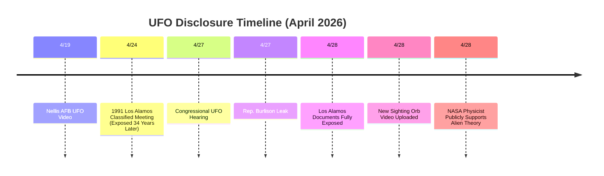

<iframe src="https://www.youtube.com/embed/vUP1MIcD530" frameborder="0" allowfullscreen loading="lazy"></iframe>

## 🌍 Bombshell: Los Alamos Classified Documents Exposed

On April 28, 2026, journalist and documentary filmmaker **Jeremy Corbell** disclosed a batch of classified documents from **Los Alamos National Laboratory**. These documents **100% prove that the U.S. government secretly conducted a cross-agency UFO research program over the past several decades**.

In exclusive interviews with *Daily Mail* and *NewsNation*, Corbell stated that these documents came from the son of a deceased high-level cybersecurity director who had worked at Los Alamos National Laboratory. After his death, his son handed over this batch of classified documents to Corbell.

> "**These documents are ironclad proof of the U.S. government's long-term secret UFO program.**" — Jeremy Corbell

## 📄 Core Content of the Documents

This batch of documents includes:
- **Minutes of a full-day classified meeting** held at Los Alamos on **April 24, 1991**
- Attendees included representatives from **the CIA, NSA, U.S. Army, and U.S. Navy**
- The meeting discussed the **1987 Gulf Breeze, Florida UFO incident** and the **1989 Belgian UFO wave**
- **Hand-drawn technical sketches of disc-shaped craft and cylindrical objects**
- **Diagrams of crop circle formations**
- **Soviet UFO sighting reports collected by Russian intelligence agencies**
- Los Alamos scientists referred to UFOs as **"atmospheric anomalies"**

Corbell noted: "While these documents do not confirm the recovery of alien craft or the existence of extraterrestrial beings, they **clearly prove that the U.S. government conducted a decades-long secret investigation into UFOs**."

## 🗣️ Rep. Burlison: U.S. Military "Lured" UFOs into Appearance

Meanwhile, **Rep. Eric Burlison (R-Mo.)** made even more startling allegations — that the U.S. military used a **"Mass-Witness Protocol"** to deliberately lure UFO craft into public view!

Burlison described:
> "This was a '**perfectly executed**' event. Our personnel intentionally lured the craft into visual range, creating a large number of witnesses — the intelligence has even reached senior levels in Congress."

This unique "luring method" is seen as a **strategic disclosure tactic** — having multiple people witness simultaneously to increase the credibility of the event.

| 📍 *U.S. Capitol Hill* | 📅 *April 27–28, 2026* | 🔍 *Government Disclosure / Hearing Leak* |

## 🔥 Corbell Calls for Release of 46 Classified Videos

In news interviews, Corbell further urged the Trump administration to release **46 classified UFO videos obtained by the intelligence community**. He described these videos as showing:

> "**Unbelievable capabilities beyond the scope of known technology.**"

Corbell expressed cautious optimism that President Trump might declassify UFO files, believing that the release of these documents along with the 46 videos would completely rewrite humanity's understanding of unidentified aerial phenomena.

## 📹 Fresh Sighting Video Today: 4/28 Ascending Orb

Today (April 28, 06:52 UTC), a new UFO sighting video appeared on YouTube. The videographer captured an **ascending orb**, along with so-called "go fasts" and a "wizard's finger trick" effect between 7:45–7:50:

- Time of capture: **April 28, 2026, 06:52 UTC**
- Object characteristics: **Ascending orb**, accompanied by multiple fast-moving bright spots
- No official response or explanation yet
- Original video can be viewed in the YouTube player above

| 📍 *Undisclosed Location* | 📅 *April 28, 2026* | 🔍 *Latest Sighting / Unverified* |

## 🧪 NASA Physicist: Aliens May Already Be Living on Earth

On the same day, NASA physicist **Dr. Kevin Knuth** made a startling statement on Mayim Bialik's podcast:

> "**Aliens may already be living on Earth.**"

He also discussed cases of **UAPs shutting down U.S. nuclear missile systems** and the government's comprehensive cover-up. The physicist's endorsement added a more serious scientific weight to the recent fervent discussions.

## 🔮 Overall Analysis: A Multi-Pronged Disclosure Process

Looking at the intense news from the past 24 hours, UFO disclosure is advancing simultaneously on multiple fronts:

1. **Document Front** 📄 — Los Alamos classified documents exposed, proving long-term secret U.S. government research
2. **Congressional Front** 🏛️ — Burlison reveals "Mass-Witness Protocol," multiple lawmakers pushing for transparency
3. **Media Front** 🎙️ — Corbell, Knuth, and others speaking out in mainstream media
4. **Civilian Front** 📹 — New sighting videos continue to emerge

> 💡 **Jackson's Commentary**: The classified meeting minutes from 34 years ago, now discovered among the belongings of a deceased security director — this is no coincidence. When scientists from Los Alamos (the heart of nuclear weapons development), the CIA, NSA, Army, and Navy all sit down together to discuss UFOs, do you still believe "they're just weather balloons"?

The pace of this disclosure is unprecedented. It seems that 2026 is becoming the year humanity formally confronts its cosmic neighbors.

<iframe src="https://www.youtube.com/embed/5-PsIEy-H_I" frameborder="0" allowfullscreen loading="lazy"></iframe>

---

**📢 Will the Los Alamos documents be the final piece of the government's cover-up puzzle? Leave a comment and tell me what you think!**

| 📍 *Global — U.S.-Led Disclosure* | 📅 *April 28, 2026* | 🔍 *Comprehensive Analysis / Breaking News* |