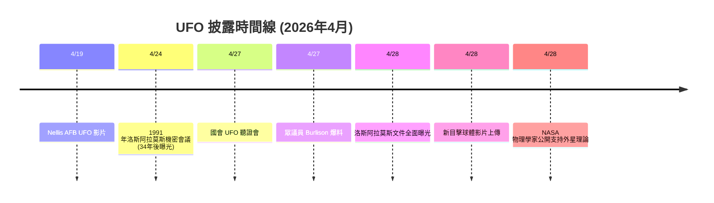

<iframe src="https://www.youtube.com/embed/vUP1MIcD530" frameborder="0" allowfullscreen loading="lazy"></iframe>

## 🌍 重磅炸彈：洛斯阿拉莫斯機密文件曝光

2026 年 4 月 28 日，記者兼紀錄片導演 **Jeremy Corbell** 披露了一批來自 **洛斯阿拉莫斯國家實驗室（Los Alamos National Laboratory）** 的機密文件。這些文件**百分之百證明美國政府在過去數十年間，秘密進行了跨機構的 UFO 研究計畫**。

Corbell 在《Daily Mail》與《NewsNation》專訪中表示，這些文件來自一名已故的高階網路安全主管的兒子——該主管生前任職於洛斯阿拉莫斯國家實驗室。他死後，其子將這批機密文件交給了 Corbell。

> 「**這些文件是美國長期秘密 UFO 計畫的鐵證。**」— Jeremy Corbell

## 📄 文件核心內容

這批文件包含了：
- **1991 年 4 月 24 日** 在洛斯阿拉莫斯召開的 **全日機密會議記錄**
- 與會者包括 **CIA（中央情報局）、NSA（國家安全局）、美國陸軍、美國海軍** 代表
- 會議討論了 **1987 年佛羅里達 Gulf Breeze UFO 事件** 與 **1989 年比利時 UFO 浪潮**
- **碟形飛行器、圓柱形物體手繪技術草圖**
- **麥田圈形成圖解**
- **俄羅斯情報機構蒐集的蘇聯 UFO 目擊報告**
- 洛斯阿拉莫斯科學家將 UFO 稱為 **「大氣異常」（atmospheric anomalies）**

Corbell 指出：「這些文件雖未證實外星飛行器回收或外星生物存在，但**清楚證明了美國政府對 UFO 進行了長達數十年的秘密調查**。」

## 🗣️ 眾議員 Burlison：美軍「誘引」UFO 現身

與此同時，**眾議員 Eric Burlison（密蘇里州共和黨）** 爆出更驚人的指控——美軍曾使用 **「大規模目擊協議」（Mass-Witness Protocol）**，刻意誘引 UFO 飛行器現身於公眾視野！

Burlison 描述：
> 「這是一次『**完美執行**』的事件，我們的人員故意將飛行器引誘到目擊範圍內，創造了大量見證人——情報甚至已經傳到了國會高層。」

這項獨特的「誘引方式」被視為一種**戰略性披露手段**——讓多人同時見證，以增加事件的可信度。

| 📍 *美國國會山莊* | 📅 *2026 年 4 月 27–28 日* | 🔍 *政府披露／聽證爆料* |

## 🔥 Corbell 呼籲公布 46 段機密影片

在新聞專訪中，Corbell 進一步要求川普政府公布 **46 段由情報界取得的機密 UFO 影片**。他描述這些影片展示了：

> 「**超越已知技術範疇的難以置信的能力。**」

Corbell 對川普總統可能解密 UFO 檔案表示審慎樂觀，認為這批文件再加上 46 段影片的釋出，將徹底改寫人類對不明飛行現象的理解。

## 📹 今日新鮮目擊影片：4/28 升空球體

今天（4 月 28 日 06:52 UTC）YouTube 上出現了一段最新的 UFO 目擊影片，拍攝者記錄了一個**升空中的球體**，影片中還出現了所謂的「快速物體」（go fasts）以及 7:45–7:50 之間的「巫師手指把戲」效果：

- 拍攝時間：**2026 年 4 月 28 日 06:52 UTC**
- 物體特徵：**升空球體**，伴隨多個快速移動亮點
- 尚未有官方回應或解釋
- 原始影片可於上方 YouTube 播放器觀看

| 📍 *未公開地點* | 📅 *2026 年 4 月 28 日* | 🔍 *最新目擊／未驗證* |

## 🧪 NASA 物理學家：外星人可能已在地球生活

同日，NASA 物理學家 **Dr. Kevin Knuth** 在 Mayim Bialik 的播客中驚人發言：

> 「**外星人可能已經生活在地球上。**」

他同時討論了 **UAP 曾關閉美國核子飛彈系統** 的案例，以及政府全面的掩蓋行動。物理學家的背書為近期的狂熱討論增添了更嚴肅的科學分量。

## 🔮 全局分析：多線並進的披露進程

從這 24 小時內的密集新聞來看，UFO 披露正在多條戰線上同步推進：

1. **檔案戰線** 📄 — 洛斯阿拉莫斯機密文件曝光，證明美國政府長期秘密研究
2. **國會戰線** 🏛️ — Burlison 揭密「大規模目擊協議」，多位議員推動透明化
3. **媒體戰線** 🎙️ — Corbell、Knuth 等人在主流媒體發聲
4. **民間戰線** 📹 — 新目擊影片持續湧現

> 💡 **𠎀克森 點評**：34 年前的機密會議記錄，如今在一位已故安全主管的遺物中被發現——這不是巧合。當洛斯阿拉莫斯（核武研發心臟地帶）的科學家、中央情報局、國家安全局、陸軍、海軍全坐在一起討論 UFO，你還相信「這只是 weather balloons」嗎？

這次的披露節奏前所未有。看來 2026 年，正在成為人類正式面對宇宙鄰居的那一年。

<iframe src="https://www.youtube.com/embed/5-PsIEy-H_I" frameborder="0" allowfullscreen loading="lazy"></iframe>

---

**📢 洛斯阿拉莫斯文件會是政府掩蓋真相的最後一塊拼圖嗎？留言告訴我你的想法！**

| 📍 *全球 — 美國主導披露* | 📅 *2026 年 4 月 28 日* | 🔍 *綜合分析／突發新聞* |
